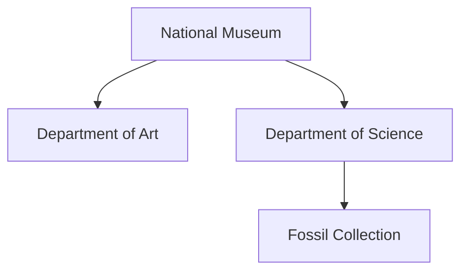

# SubjectStore

**SubjectStore** is a lightweight Java library for building, indexing, and querying hierarchical entities called **subjects**. Each subject can hold structured attributes, contain child subjects, and optionally maintain a time-stamped history of its state or metrics.

It is designed for applications that need both a flexible data model and a lightweight, embeddable query engine — such as knowledge bases, simulations, digital twins, domain models, or semantic data layers.

## Features

- Lightweight and fast
- Fluent creation and update API
- Hierarchical subjects with typed attributes
- Expressive query interface (`with`, `where`, `matches`, `contains`)
- Support for time-series historical data per subject

---

## Quick Example

### Installation via Maven

To use `SubjectStore` in your Java project, add the following dependency to your `pom.xml`:

```xml
<dependency>
    <groupId>systems.intino</groupId>
    <artifactId>subject-store</artifactId>
    <version>1.1.0</version>
</dependency>
```

### Creating and accessing subjects

This snippet shows how to open a `SubjectStore`, create a new subject, check for existence, and retrieve it:

```java
try (SubjectStore store = new SubjectStore("jdbc:sqlite:buildings.iss")) {
    Subject eiffel = store.create("eiffel tower", "building");

    boolean exists = store.has("taj mahal", "building");

    Subject eiffel = store.get("eiffel tower", "building");
}
```

### Managing hierarchical structures

`SubjectStore` allows subjects to be organized hierarchically by nesting child subjects under parents. The following example models a museum and its internal departments, focusing on structural identifiers.



```java
Subject museum = store.create("national-museum", "building");
    Subject art = museum.create("art", "department");
    Subject science = museum.create("science", "department");
        Subject fossils = science.create("fossils", "section");

```

### Accessing hierarchical subjects


For nested subjects, you can use hierarchical paths in the form ```parent.type/child.type/grandchild.type```.

```java
Subject department = store.get("national-museum.building/science.department");
```

Children subjects can also be accessed by navigating from their parent:

```java
Subject section = department.get("fossils", "section")
```

Additionally, you can navigate upwards in the hierarchy:

```java
Subject building = section.parent().parent();
```

### Indexing subjects

You can also retrieve subjects through flexible queries based on their indexed attributes. To make subjects searchable, you can assign indexing attributes using the `index()` method. These attributes are static and optimized for querying — such as names, categories, dates, and locations.

```java
eiffel.index()
    .set("name", "Eiffel Tower")
    .set("year", 1889)
    .put("city", "Paris")
    .put("country", "France")
    .put("continent", "Europe")
    .terminate();

Subject eiffel = store.subjects("building")
		.with("city", "Paris")
		.first();

List<Subject> towers = store.subjects("building")
		.where("name").contains("tower")
		.collect();

List<Subject> modernBuildings = store.subjects("building")
		.where("year").that(v -> toNumber(v) > 1900)
		.collect();
```

### Tracking historical data

Each subject in `SubjectStore` can record time-stamped historical data using the `history()` method. This feature allows tracking of evolving metrics, state changes, or temporal observations without altering the subject’s current indexed attributes. Historical records are associated with both a date and a source (e.g.,`"sensor"`, `"website"`, `"manual"`), and can store arbitrary key-value pairs.

```java
try (SubjectHistory history = subject.history()) {
    history.on(LocalDate.of(2025, 4, 17), "website")
        .put("state", "open")
        .put("visitants", 3500)
        .put("income", 42000)
        .terminate();
}
```

### Analyzing subject history

Historical data can later be queried as typed signals and summarized over defined time periods:

```java
try (SubjectHistory history = subject.history()) {
    NumericalSignal visitants = history.query()
        .number("visitants")
        .get(TimeSpan.LastMonth);

    // Average visitants in the last month
    double average = visitants.summary().mean();

    CategoricalSignal states = history.query()
        .text("state")
        .get(LocalDate.of(2025, 1, 1), LocalDate.now());
        
    // Most frequent state in this year
    String state = states.summary().mode();
}
```

### Creating a view from the store

SubjectStore views provide a structured and summarized perspective over a subset of subjects of the same type. You can use them to analyze categorical distributions, frequencies, and filterable columns across your dataset.

```java
SubjectIndexView view = store.view()
    .type("building")
    .add("year")
    .add("city")
    .build();
```

Each column in a view offers a summary, including unique categories and their frequencies:

```java
List<String> statuses = view.column("city").summary().categories();
int parisCount = view.column("cicty").summary().frequency("Paris");
```
