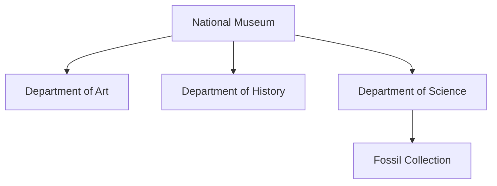

# SubjectStore

**SubjectStore** is a lightweight Java library for building, indexing, and querying hierarchical entities called **subjects**. Each subject can hold structured attributes, contain child subjects, and optionally maintain a time-stamped history of its state or metrics.

It is designed for applications that need both a flexible data model and a lightweight, embeddable query engine — such as knowledge bases, simulations, digital twins, domain models, or semantic data layers.

## Features

- Hierarchical subjects with typed attributes
- Fluent creation and update API
- Expressive query interface (`with`, `where`, `matches`, `contains`)
- Support for time-series historical data per subject
- Lightweight and fast

---

## Quick Example

To use `SubjectStore` in your Java project, add the following dependency to your `pom.xml`:

```xml
<dependency>
    <groupId>systems.intino</groupId>
    <artifactId>subject-store</artifactId>
    <version>1.1.0</version>
</dependency>
```


This snippet shows how to create a single subject and assign indexing attributes. The `index()` method is used to assign  static attributes intended for querying and identification, such as names, categories, or locations. 

```java
try (SubjectStore store = new SubjectStore("jdbc:sqlite:buildings.iss")) {
    Subject eiffel = store.create("eiffel tower", "building");

    eiffel.index()
        .set("name", "Eiffel Tower")
        .set("year", 1889)
        .put("city", "Paris")
        .put("country", "France")
        .put("continent", "Europe")
        .terminate();
}
```

## Retrieving Subjects

You can retrieve subjects either by their unique name and type, or through flexible queries based on their indexed attributes.

```java
boolean exists = store.has("taj mahal", "building");

Subject eiffel = store.get("eiffel tower", "building");

Subject eiffel = store.subjects("building")
    .with("city", "Paris")
    .first();

List<Subject> towers = store.subjects("building")
    .where("name").contains("tower")
    .collect();

List<Subject> modernBuildings = store.subjects("building")
    .where("year").that(v -> toNumber(v) > 1900)
    .collect();

```

## Tracking Historical Data

Each subject in `SubjectStore` can record time-stamped historical data using the `history()` method. This feature allows tracking of evolving metrics, state changes, or temporal observations without altering the subject’s current indexed attributes.

Historical records are associated with both a date and a source (e.g.,`"sensor"`, `"website"`, `"manual"`), and can store arbitrary key-value pairs.

```java
try (SubjectHistory history = subject.history()) {
    history.on(LocalDate.of(2025, 4, 17), "website")
        .put("state", "open")
        .put("visitants", 3500)
        .put("income", 42000)
        .terminate();
}
```

Historical data can later be queried as typed signals and summarized over defined time periods:

```java
try (SubjectHistory history = subject.history()) {
    NumericalSignal visitants = history.query()
        .number("visitants")
        .get(TimeSpan.LastMonth);

    // Average visitants in the last month
    double average = visitants.summary().mean();

    CategoricalSignal states = history.query()
        .text("state")
        .get(LocalDate.of(2025, 1, 1), LocalDate.now());
        
    // Most frequent state in this year
    String state = states.summary().mode();
}
```

## Managing Hierarchical Structures

`SubjectStore` allows subjects to be organized hierarchically by nesting child subjects under parents. The following example models a museum and its internal departments, focusing on structural identifiers.



```java
Subject museum = store.create("national-museum", "institution");

museum.index()
    .set("name", "National Museum")
    .put("city", "Washington D.C.")
    .put("country", "USA")
    .put("type", "cultural")
    .terminate();

Subject art = museum.create("art", "department");
art.index()
    .put("name", "Department of Art")
    .put("floor", 1)
    .terminate();

Subject science = museum.create("science", "department");
science.index()
    .put("name", "Department of Science")
    .put("floor", 2)
    .terminate();

Subject fossils = science.create("fossils", "section");
fossils.index()
    .put("name", "Fossil Collection")
    .put("room", "2B")
    .terminate();

```

## Accessing Subjects: via Index or Hierarchical Navigation

`SubjectStore` allows retrieving subjects in two primary ways:

1. Direct Access
2. Access from Another Subject

### Direct Access

You can retrieve a subject directly from the store using its unique name and type:

```java
Subject eiffel = store.get("eiffel tower", "building");
```

Alternatively, for nested subjects, you can use hierarchical paths in the form ```parent.type/child.type/grandchild.type```.

```java
Subject deck = store.get("burj khalifa.building/observation deck.detail");
```


### Access from Another Subject

Subjects can also be accessed by navigating from their parent:

```java
Subject building = store.get("burj khalifa", "building");
Subject deck = building.children("detail")
    .with("name", "At the Top")
    .first();
```

This pattern is useful when traversing known relationships or building recursive structures.

Additionally, you can navigate upwards in the hierarchy:

```java
Subject parent = deck.parent();
```
