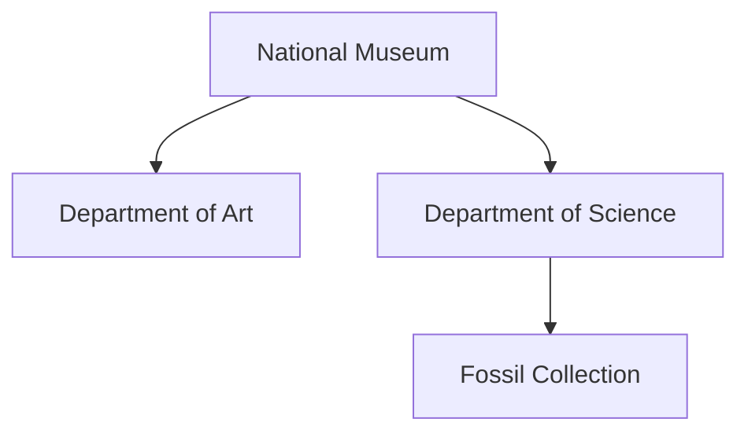

# SubjectStore

**SubjectStore** is a lightweight Java library for building, indexing, and querying hierarchical entities called **subjects**. Each subject can hold attributes, can contain child subjects, and can maintain a time-stamped history of its state or metrics.

It is designed for applications that need both a flexible data model and a lightweight, embeddable query engine — such as knowledge bases, simulations, digital twins, domain models, or semantic data layers.

## Features

- Lightweight and fast
- Fluent creation and update API
- Hierarchical subjects with typed attributes
- Expressive query interface (`with`, `where`, `matches`, `contains`)
- Support for time-series historical data per subject

---

## Quick Example

### Installation via Maven

To use `SubjectStore` in your Java project, add the following dependency to your `pom.xml`:

```xml
<dependency>
    <groupId>systems.intino.datamarts</groupId>
    <artifactId>subject-store</artifactId>
    <version>2.1.5</version>
</dependency>
```

### Creating and accessing subjects

This snippet shows how to use a `SubjectStore`, create a new subject, check for existence, and query it.

The index.triples file acts as an inverted index that enables fast retrieval of Subject entries stored in the SubjectStore. It stores static key-value pairs that have been assigned via the update() method. These attributes are internally optimized for efficient lookup and filtering.

Once a subject has been updated, the associated attributes can be retrieved programmatically. The get() method retrieves a string representation of the values assigned to a specific indexed attribute. If multiple values are present, they are joined using a configurable separator (default is ", ").

To access all indexed values of a subject, you can use the terms() method:

```java
SubjectStore store = new SubjectStore(new File("index.triples"));
Subject eiffel = store.create("eiffel tower", "building");
eiffel.update()
    .set("name", "Eiffel Tower")
    .set("year", 1889)
    .put("city", "Paris")
    .put("country", "France")
    .put("continent", "Europe");

boolean exists = store.has("taj mahal", "building");

Subject building = store.open("eiffel tower", "building");

if (building.has("country")) System.out.println(building + "has country")
String country = building.get("country")

List<Term> terms = eiffel.terms(); // List of all index terms

```

To keep the index efficient and up to date, it is necessary to periodically consolidate the indexed data using the seal() method.

```java
String city = eiffel.get("city"); // "Paris"
```


### Managing hierarchical structures

`SubjectStore` allows subjects to be organized hierarchically by nesting child subjects under parents. The following example models a museum and its internal departments, focusing on structural identifiers.



```java
Subject museum = store.create("national-museum", "building");
    Subject art = museum.create("art", "department");
    Subject science = museum.create("science", "department");
        Subject fossils = science.create("fossils", "collection");

```

### Accessing hierarchical subjects

For nested subjects, you can use hierarchical paths in the form ```parent.type/child.type/grandchild.type```.

```java
Subject department = store.open("national-museum.building/science.department");
```

Children subjects can also be accessed by navigating from their parent:

```java
Subject collection = department.open("fossils", "collection")
```

Additionally, you can navigate upwards in the hierarchy:

```java
Subject building = collection.parent().parent();
```

### Querying subjects

Subjects can also be retrieved using flexible queries based on their indexed attributes. To enable this, you can assign indexing attributes. 

```java
Subject eiffel = store.subjects()
        .type("building")
		.where("city").equals("Paris")
		.first();

List<Subject> towers = store.subjects()
        .type("building")
		.where("name").contains("tower")
		.collect();

List<Subject> modernBuildings = store.subjects()
		.type("building")
		.where("year").satisfy(v -> toNumber(v) > 1900)
        .orderBy("year", NumericAscending)
		.collect();
```


Subjects can also be queried using a DSL that combines filters and sorting instructions.

```java
Subject newestBuilding = store.subjects("type:building root order:year?num&desc").first();
```

A query string consists of space-separated clauses:
```
name:FUNCTION:VALUE type:TYPE [root] [(parent|under):SUBJECT] [where:TAG=VALUE] [order:ORDER]

where
- FUNCTION: `startsWith`, `contains`, `endsWith` 
- MODE (optional): `text`, `num`, or `time` (default is `text`)
- DIRECTION (optional): `asc` or `desc` (default is `asc`)
```

| Clause    | Description                                  | Example                   |
|-----------|----------------------------------------------|---------------------------|
| `name:`   | Filters subjects by name                     | `name:startsWith:#`       |
| `type:`   | Filters subjects by type                     | `type:building`           |
| `root`    | Selects only top-level (root) subjects       | `root`                    |
| `parent:` | Selects subjects whose direct parent matches | `parent:001.zone`         |
| `under:`  | Selects subjects nested under a given parent | `under:a.module`          |
| `where:`  | Filters by a tag's exact value               | `where:location=Spain`    |
| `order:`  | Sorts alphabetically by name (ascending)     | `order:name`              |
|           | Sorts alphabetically by name (ascending)     | `order:name?asc`          |
|           | Sorts numerically by height (ascending)      | `order:height?num`        |
|           | Sorts by year, newest first                  | `order:year?num&desc`     |
|           | Sorts by creation time, newest first         | `order:created?time&desc` |

### Tracking historical data

Each Subject in the SubjectStore can record time-stamped historical data. This mechanism allows tracking dynamic attributes such as changing states, evolving metrics, or periodic observations, without altering the subject’s current indexed attributes.

Historical entries are associated with a specific date, a source identifier (e.g. "sensor", "website", "manual"), and a set of arbitrary key-value pairs representing the observed data. This makes it possible to capture the temporal evolution of a subject over time. Historical data is stored separately from the main index file. While static attributes are indexed in index.triples, time-stamped entries are persisted in a dedicated SQL database configured via JDBC. This design ensures high performance for both real-time queries and historical analysis.

To insert historical data into a Subject, you use the historyOf(subject) method provided by the SubjectStore. This gives you access to the subject’s historical timeline, where you can record time-stamped observations. Each record is created with the .on(date, source) method, followed by one or more .put(key, value) calls to define the observed attributes.

Once all data for that timestamp is added, you must call .terminate() to commit the entry.

Here is a complete example:

```java
Connection connection = DriverManager.getConnection("jdbc:sqlite:buildings.iss");
connection.setAutoCommit(false);

SubjectStore store = new SubjectStore(new File("index.triples"))
        .connection(connection);

Subject subject = store.open("eiffel tower", "building");

SubjectHistory history = store.historyOf(subject);

history.on("2025-04-17", "website")
    .put("state", "open")
    .put("visitants", 3500)
    .put("income", 42000)
    .terminate();
```

In this case, historical entries are saved in a SQLite database file named buildings.iss. The system supports any JDBC-compatible database, such as SQLite, PostgreSQL, MySQL or MariaDB, allowing you to scale or integrate according to your needs.


### Batch update history

Inserting lots of historical data with transactions can be very slow, because each time `Transaction.terminate()` is called, it commits to the underlying connection.

For those cases, use batch mode to commit multiple transactions at once. For example:

```java
SubjectHistory history = store.historyOf(subject);

SubjectHistory.Batch batch = history.batch();

Instant from = Instant.parse("2025-05-01T00:00:00Z");

for(int i = 0;i < 1000;i++) {
    Instant ts = from.plusSeconds(i);
    history.on(ts, "sensor")
        .put("state", stateAt(ts))
        .put("temperature", temperatureAt(ts))
        .terminate();
}

batch.terminate();
```


### Analyzing subject history

Historical data can later be queried as typed signals and summarized over defined time periods:

```java
NumericalSignal visitants = history.query()
    .number("visitants")
    .get(TimeSpan.LastMonth);

// Average visitants in the last month
double average = visitants.summary().mean();

CategoricalSignal states = history.query()
    .text("state")
    .get("2020", "2024");
    
// Most frequent state from first day of 2020 to first day of 2024
String state = states.summary().mode();

// Count the appearances of the state 'closed'
int timesClosed = states.summary().frequency("closed");
```
---

## Generating Subject Index Views

Subject Index View generation provides a structured and summarized perspective over a subset of subjects of the same type. These views are built exclusively from indexed fields, and can be used to analyze categorical distributions, value frequencies, and filterable column definitions across your dataset.

```java
List<Subject> subjects = store.subjects("building").collect();
SubjectIndexView.of(subjects)
    .add("year")
    .add("city")
    .export().to(new FileOutputStream("view.tsv"));
```

Each column in a view offers stats, including unique categories and their frequencies:

```java
List<String> statuses = view.column("city").stats().categories();
int parisCount = view.column("city").stats().frequency("Paris");
```

## Generating Subject History Views

Subject History View generation allows transforming the historical data recorded for a subject into aggregated tables organized by time intervals. Each row represents a time segment (e.g., a year), and each column contains the result of an operation evaluated over the data in that interval.

```java
SubjectHistoryView.of(history)
		.from("1980")
		.to("2025-04")
		.duration("P1M")
		.add("tourist-visits", "visits.count")
		.add("average-temperature", "temperature.average")
		.export().to(...);
```

The historyFormat can also be defined using a YAML string. The following example produces a yearly table of a building’s history, where each row represents one year and each column contains an aggregated, normalized, or derived value based on that building’s data:

```java
SubjectHistoryView.of(history)
    .with(historyFormat)
    .export().onlyCompleteRows().to(...)
```

```yaml
rows:
  from: 1980
  to: 2025-04
  period: P1M

columns:
  - name: year
    expr: ts.year

  - name: decade
    expr: floor(ts.year / 10) * 10

  - name: visits
    expr: visits.count

  - name: temperature
    expr: temperature.average

  - name: temp-smoothed
    expr: temperature
    filters: [RollingAverage:5]

  - name: temp-index
    expr: temp-smoothed * 100

  - name: country
    expr: country.mode
```

For a complete description of the historyFormat syntax, available fields, filters, and functions, see the [Format Reference](help/FormatReference.md)