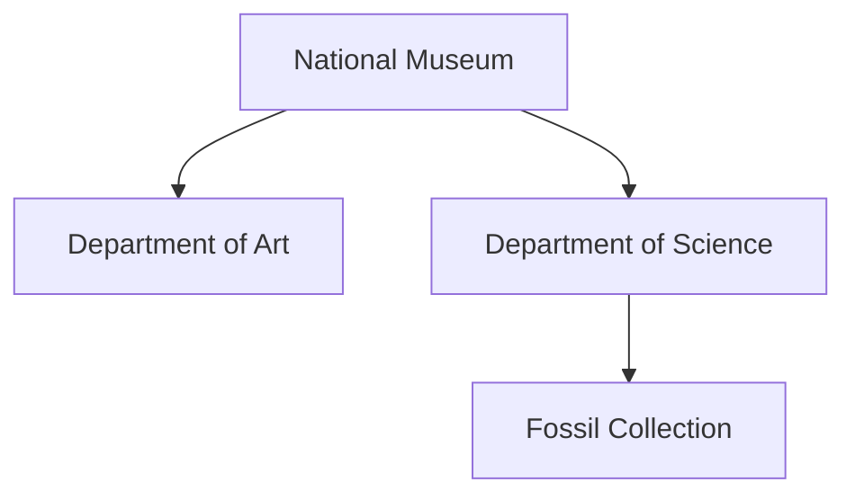

# SubjectStore

**SubjectStore** is a lightweight Java library for building, indexing, and querying hierarchical entities called **subjects**. Each subject can hold attributes, can contain child subjects, and can maintain a time-stamped history of its state or metrics.

It is designed for applications that need both a flexible data model and a lightweight, embeddable query engine — such as knowledge bases, simulations, digital twins, domain models, or semantic data layers.

## Features

- Lightweight and fast
- Fluent creation and update API
- Hierarchical subjects with typed attributes
- Expressive query interface (`with`, `where`, `matches`, `contains`)
- Support for time-series historical data per subject

---

## Quick Example

### Installation via Maven

To use `SubjectStore` in your Java project, add the following dependency to your `pom.xml`:

```xml
<dependency>
    <groupId>systems.intino.datamarts</groupId>
    <artifactId>subject-store</artifactId>
    <version>2.0.0</version>
</dependency>
```

### Creating and accessing subjects

This snippet shows how to use a `SubjectStore`, create a new subject, check for existence, and open it:

```java
try (SubjectStore store = new SubjectStore("jdbc:sqlite:buildings.iss")) {
    Subject eiffel = store.create("eiffel tower", "building");

    boolean exists = store.has("taj mahal", "building");

    Subject eiffel = store.open("eiffel tower", "building");
}
```

### Managing hierarchical structures

`SubjectStore` allows subjects to be organized hierarchically by nesting child subjects under parents. The following example models a museum and its internal departments, focusing on structural identifiers.



```java
Subject museum = store.create("national-museum", "building");
    Subject art = museum.create("art", "department");
    Subject science = museum.create("science", "department");
        Subject fossils = science.create("fossils", "collection");

```

### Accessing hierarchical subjects


For nested subjects, you can use hierarchical paths in the form ```parent.type/child.type/grandchild.type```.

```java
Subject department = store.open("national-museum.building/science.department");
```

Children subjects can also be accessed by navigating from their parent:

```java
Subject collection = department.open("fossils", "collection")
```

Additionally, you can navigate upwards in the hierarchy:

```java
Subject building = collection.parent().parent();
```

### Indexing subjects

Subjects can also be retrieved using flexible queries based on their indexed attributes. To enable this, you can assign indexing attributes using the `index()` method. These attributes are static and optimized for efficient querying — such as names, categories, dates, and locations.

```java
eiffel.index()
    .set("name", "Eiffel Tower")
    .set("year", 1889)
    .put("city", "Paris")
    .put("country", "France")
    .put("continent", "Europe")
    .terminate();

Subject eiffel = store.subjects("building")
		.with("city", "Paris")
		.first();

List<Subject> towers = store.subjects("building")
		.where("name").contains("tower")
		.collect();

List<Subject> modernBuildings = store.subjects("building")
		.where("year").that(v -> toNumber(v) > 1900)
		.collect();
```

Once a subject has been indexed, the associated attributes can be retrieved programmatically.

The get() method retrieves a string representation of the values assigned to a specific indexed attribute. If multiple values are present, they are joined using a configurable separator (default is ", ").

```java
String city = eiffel.get("city"); // "Paris"
```

To access all indexed values, you can use the terms() method:
```java
List<Term> terms = eiffel.terms(); // List of all index terms
```

### Tracking historical data

Each subject in `SubjectStore` can record time-stamped historical data using the `history()` method. This feature allows tracking of evolving metrics, state changes, or temporal observations without altering the subject’s current indexed attributes. Historical records are associated with both a date and a source (e.g.,`"sensor"`, `"website"`, `"manual"`), and can store arbitrary key-value pairs.

```java
SubjectHistory history = subject.history();
history.on("2025-04-17", "website")
    .put("state", "open")
    .put("visitants", 3500)
    .put("income", 42000)
    .terminate();
```

### Analyzing subject history

Historical data can later be queried as typed signals and summarized over defined time periods:

```java
SubjectHistory history = subject.history();
NumericalSignal visitants = history.query()
    .number("visitants")
    .get(TimeSpan.LastMonth);

// Average visitants in the last month
double average = visitants.stats().mean();

CategoricalSignal states = history.query()
    .text("state")
    .get("2020", "2024");
    
// Most frequent state from first day of 2020 to first day of 2024
String state = states.stats().mode();
```
---

## Generating Subject Index Views

Subject Index View generation provides a structured and summarized perspective over a subset of subjects of the same type. These views are built exclusively from indexed fields, and can be used to analyze categorical distributions, value frequencies, and filterable column definitions across your dataset.

```java
SubjectIndexView view = store.view()
    .type("building")
    .add("year")
    .add("city")
    .build();
```

Each column in a view offers a stats, including unique categories and their frequencies:

```java
List<String> statuses = view.column("city").stats().categories();
int parisCount = view.column("city").stats().frequency("Paris");
```

## Generating Subject History Views

Subject History View generation allows transforming the historical data recorded for a subject into aggregated tables organized by time intervals. Each row represents a time segment (e.g., a year), and each column contains the result of an operation evaluated over the data in that interval.

```java
SubjectHistoryView buildingView = store.viewOf("taj mahal.building")
    .from("1980")
    .to("2025-04")
    .period("P1M")
    .add("tourist-visits", "visits.count")
    .add("average-temperature", "temperature.average")
    .build();
```

The historyFormat can also be defined using a YAML string. The following example produces a yearly table of a building’s history, where each row represents one year and each column contains an aggregated, normalized, or derived value based on that building’s data:

```java
SubjectHistoryView buildingView = store.viewOf("taj mahal.building").with(historyFormat)
```

```yaml
rows:
  from: 1980
  to: 2025-04
  period: P1M

columns:
  - name: year
    expr: ts.year

  - name: decade
    expr: floor(ts.year / 10) * 10

  - name: visits
    expr: visits.count

  - name: temperature
    expr: temperature.average

  - name: temp-smoothed
    expr: temperature
    filters: [RollingAverage:5]

  - name: temp-index
    expr: temp-smoothed * 100

  - name: country
    expr: country.mode
```

For a complete description of the historyFormat syntax, available fields, filters, and functions, see the [Format Reference](help/FormatReference.md)